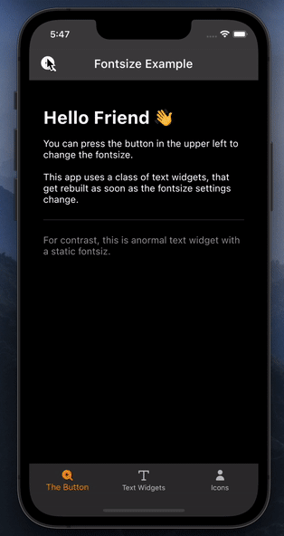

# Adjustable Fontsize (Example App)

This [Flutter](https://flutter.dev/) example app shows how users could conveniently adjust an app's fontsize. <br>
This might help people with visual impairment to use the app. <br>
Feel free to reuse and modify the code.




<br>

## Feature Description

Whenever the user presses a zoom button, a sheet pops up from the bottom, showing 3 buttons:

Label | Icon | On Pressed
--- | --- | ---
**Enlarge** | plus | Text gets bigger.
**Shrink** | minus | Text gets smaller.
**Reset** | circular arrows | Text's fontsize gets reset to its initial default value.

<br>

## Dependencies
This app uses the the following packes:

<br>

# Design Decisions


## Provider for State Management
In this project the [Provider Package](https://pub.dev/packages/provider) is used for state management. <br>
As of 2022, this is the currently recommended approach. But of course, the identical user experience could have been accomplished with alternative design choices. <br>
Check out the [Flutter Documentation](https://docs.flutter.dev/development/data-and-backend/state-mgmt/options) to learn more about state management in general.


The following graph shows how the UI's widgets interact with the implemented change notifier class **FontSizeControl**.


<br>

## Optional feature: Mark Headers to grow more subtly
When the user choses to enlarge the global fontsize, texts that are marked as headers get enlarged at a slower rate, because they typically are large already and would quickly get extremely large without improving readability.
The difference to regular text is demonstrated in the app itself.
<br>
<br>

# Understanding the Code
## State Management with Provider: 

### In file: lib/main.dart
As pointed out in the Provider documentation, all relevant Provider objects  have to live on top of the widget tree, so widgets beneath can listen to them.
This can be accomplished by passing them to the runApp-method.

```dart
void main() => runApp(MultiProvider(providers: [
      ChangeNotifierProvider(create: (context) => FontSizeControl()),
      // Add more providers here.
    ], child: const FontsizeExampleApp()));
```

### In file: lib/state_management/font_size_control.dart
The **FontSizeControl** class has two attributes that can be referenced by widgets:
* fontSizeFactor
* headerSizeFactor

Methods that change these attributes, have to call the **notifyListeners()**-method, to make the listening widgets rebuild, e.g.:
```dart
enlarge() {
    if (fontSizeFactor < 2) {
      fontSizeFactor += 0.1;
      headerSizeFactor += 0.05;
    }
    notifyListeners(); // <-- make listening widgets rebuild
  }
```


## User Interface
The three visible enlarge-, shrink- and reset-button that can be pressed by the user trigger the respective method (enlarge, shrink or reset) of the FontSizeControl object.

### UI Listener: SizeChangingText
When the